# Student-behavior-system

学生行为分析系统

---

> Contributor : Memory555
>
> Reference : https://github.com/datamonday/Face-Recognition-Class-Attendance-System
>
> Github Repo ：https://github.com/Memory555/Student-behavior-system
>
> Project Post : 2023.06.14


# 1. 项目简介及声明

**🐱‍👓本项目为大三智慧学习与教育课程设计,非完全原创代码，参考借鉴Github见上方Reference链接**。

🎠本项目使用Python3.8开发。主要包括四部分：
- 前端界面设计：使用Qt Designer（QT5）设计主界面，PyQt5编写界面控件的槽函数。
- 人脸检测算法：使用OpenCV提供的ResNet-SSD预训练模型
- 人脸识别算法：使用OpenFace开源的基于Inception的FaceNet预训练模型。
- 表情识别算法：使用OpenVINO模型库中的emotions-recognition-retail-0003人脸表情模型。
- 信息管理：使用PyMySQL实现学生信息，考勤信息的集中统一化管理。

---

#  2. 环境配置🎡

## 2.1 Anaconda 创建虚拟环境

打开官方地址并下载对应版本：

https://www.anaconda.com/products/individual#Downloads

如果追求轻量化，使用miniconda也可以，只不过没有navigator。

安装完成后，打开 Anaconda Prompt，并按以下步骤输入：

1. 创建虚拟环境 `fr` ，设置Python版本为 3.8.0

   ```shell
   conda create -n fr python==3.8
   ```

2. 激活虚拟环境

   ```shell
   conda activate fr
   ```

---

## 2.2 安装所需要的包

在新开的命令行，激活虚拟环境后，按如下步骤操作。

方式一：requirements.txt 安装

该文件是我在本地新建的测试通过的环境中所使用的的包，可以直接安装，避免了一个一个包安装的繁琐步骤。打开命令行并切换到该文件所在的根目录，输入如下命令：

   ```shell
   pip install -r requirements.txt
   ```
注：本地环境生成requirements.txt的命令：`pip freeze > requirements.txt`

---

方式二：environment.yaml 安装

这是我在本地的conda虚拟环境，实现功能类似 requirements.txt，如果安装了anaconda的话，可以直接安装。需要注意的是该方式是直接创建一个虚拟环境，如果想在已有的环境中进行配置，则只需要按方式一即可。

```shell
conda env create -f environment.yaml
```

注：导出本地的conda环境命令：`conda env export > d:/environment.yaml`

---

## 2.3 安装 dlib
- 官网：http://dlib.net/
- github：https://github.com/davisking/dlib

注意：需要先安装Visual Studio C++的Community版本或者专业版和企业版都可以，否则报错！只安装 installer 无效，仍会报错！如果之前没有安装VS内核，只安装了 installer，打开控制面板，右击修改安装，重启之后生效。

确认已经安装了VS，打开命令行，激活虚拟环境，直接命令安装即可：

```shell
pip install dlib
```

安装比较耗时，大概几分钟.


---

# 3. 系统前端设计🤖

使用 Qt Designer 设计前端界面。

## 3.1 主界面

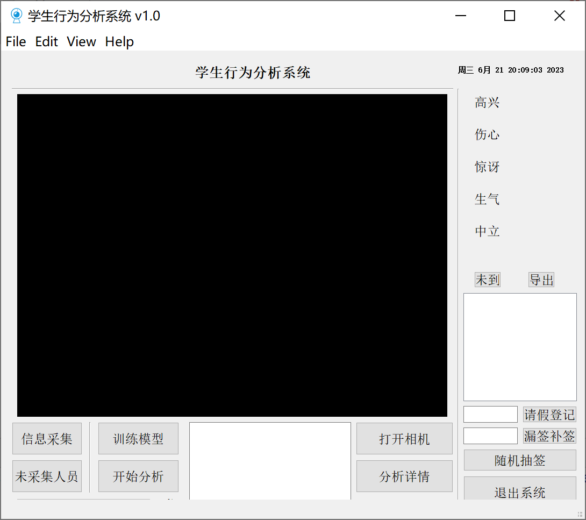

---

## 3.2 信息采集界面

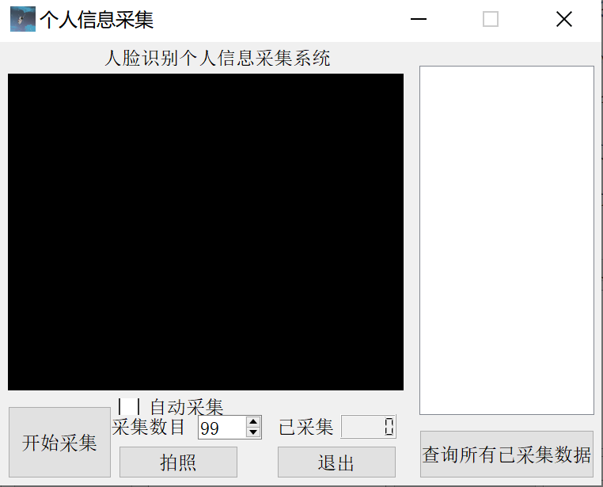

---

## 3.3 行为分析详情界面

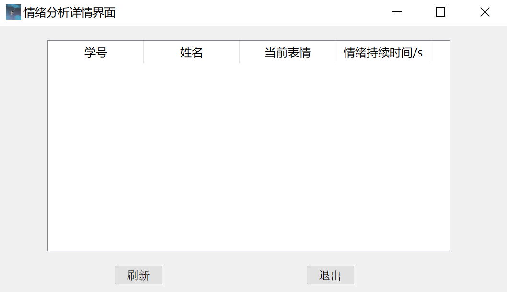

---

# 4. 系统功能介绍🛵

## 4.1 信息采集功能

通过信息采集界面实现，针对学生的人脸图片建库。

可以手动添加，可以自动采集人脸图像。注意：从自动转为手动方式时，画面会不显示，但不影响采集！

## 4.2 人脸识别简介

深度学习人脸识别流程可以总结如下（图自论文：I. Masi, Y. Wu, T. Hassner and P. Natarajan, "**Deep Face Recognition: A Survey**," 2018 31st SIBGRAPI Conference on Graphics, Patterns and Images (SIBGRAPI), 2018, pp. 471-478, doi: 10.1109/SIBGRAPI.2018.00067.）：

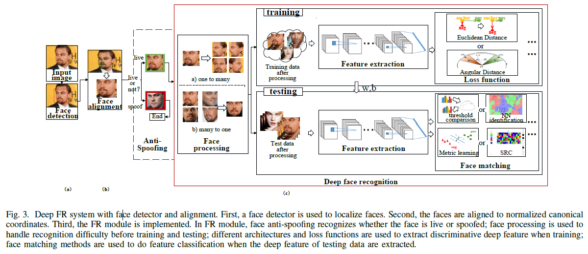

总的来说应用人脸识别分为四步：（1）人脸检测，对输入的图片应用人脸检测算法（本项目中使用OpenCV提供的训练好的ResNet-SSD模型）找出人脸的坐标，过程如下图所示：

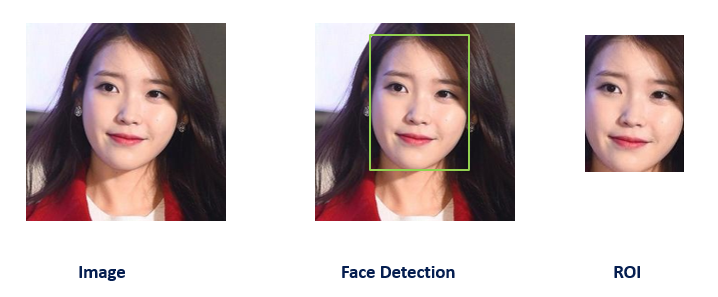

（2）应用人脸校正算法，对人脸进行校正，将图像进行保持图片相对平行的基本图像变换，例如旋转和缩放 (仿射变换, affine transformations)，使得眼睛和嘴巴尽可能靠近中心，即目的是将非正视角的人脸校正到使两眼处于同一水平位置。如下图所示：

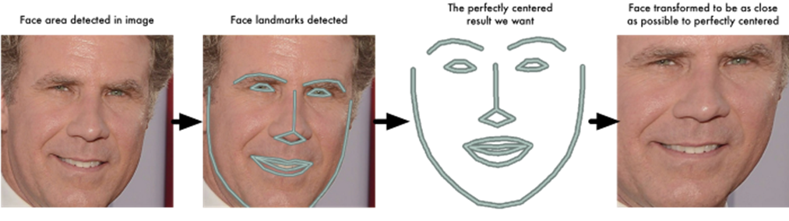

（3）使用人脸识别算法（本文中使用Google在2015年提出的FaceNet，论文 **FaceNet: A Unified Embedding for Face Recognition and Clustering**）对纯人脸图像进行特征提取，FaceNet是将人脸编码为128维的向量，又称为嵌入（embedding），这个属于在自然语言处理领域非常常用。下图是FaceNet的论文中描述的网络架构：

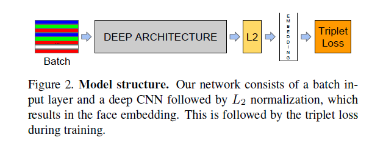

（4）如果是训练的话，上一步已经结束了，但是要应用人脸识别算法，还需要在下游任务上实现分类。故本项目中使用支持向量机（Support Vector Machine，SVM）实现对各人脸128维向量的分类任务。<font color=red> **注意：SVM本质上为二分类器，请保证人脸数据库中至少包含两个人！否则可能导致闪退！**</font>
注：SVM使用scikit-learn提供的[SVC API](https://scikit-learn.org/stable/modules/generated/sklearn.svm.SVC.html)实现。

- 一个使用SVM进行人脸识别的官方例程：[Faces recognition example using eigenfaces and SVMs](https://scikit-learn.org/stable/auto_examples/applications/plot_face_recognition.html#sphx-glr-auto-examples-applications-plot-face-recognition-py)

---

## 4.3 表情识别简介

表情识别使用OpenVINO模型库中的emotions-recognition-retail-0003人脸表情模型实现。该模型基于深度学习技术，使用卷积神经网络（CNN）架构进行训练，可以识别出七种不同的表情，包括生气、厌恶、恐惧、开心、平静、伤心和惊讶。
该模型使用的数据集是FER2013（Faces Emotion Recognition），包含35,887张48x48像素的灰度图像，其中28,709张用于训练，3,589张用于验证，3,589张用于测试。该数据集中的每个图像都被标记为七种不同的情感之一。
emotions-recognition-retail-0003模型的输入是一张人脸图像，输出是一个大小为7的向量，每个元素代表一个表情。模型的精度在FER2013测试集上达到了66.49%的准确率，可以在不同的嵌入式设备上进行加速和部署。
该模型适用于多个领域的应用，如虚拟现实、智能医疗、安防监控、智能客服等，可以帮助人们更好地理解和识别人类情感。

此外，OpenVINO是Inter开发的一套深度学习工具库，用于快速部署应用和解决方案。
当我们应用Pytorch、Tensorflow和PaddlePaddle训练好模型之后，就面临了模型部署上线问题。OpenVINO是解决这一问题的优秀工具。
更多内容可查看官方文档介绍：[OpenVINO](https://docs.openvino.ai/cn/2022.1/documentation.html)

## 4.4 查询考勤信息

通过主界面的未到按键，可以查看当前未到学生情况，会在主界面左侧文本框中显示包含迟到和旷课的学生，点击导出按键可见结果导出。

## 4.5 查询未采集学生信息

通过主界面的未采集人员按键，实现获知尚未录入人脸信息的学生。

## 4.6 补签及请假登记

通过主界面的补签和请假按键，输入学号，实现补签和请假登记，并写入数据库。

---

# 5. 数据库存取信息🥗

## 5.1 数据库可视化工具 Navicat 

使用该软件是为了方便管理维护信息，也可使用其他数据管理软件。

---

## 5.3 MySQL表格及字段说明

其主界面如下：

学生信息表：
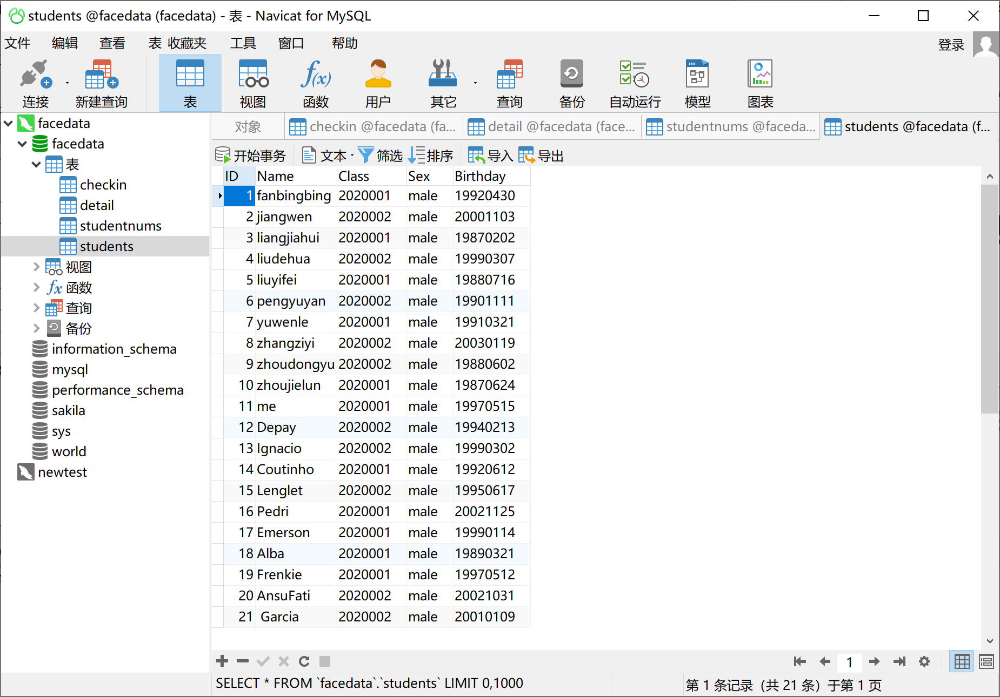

学生班级表：
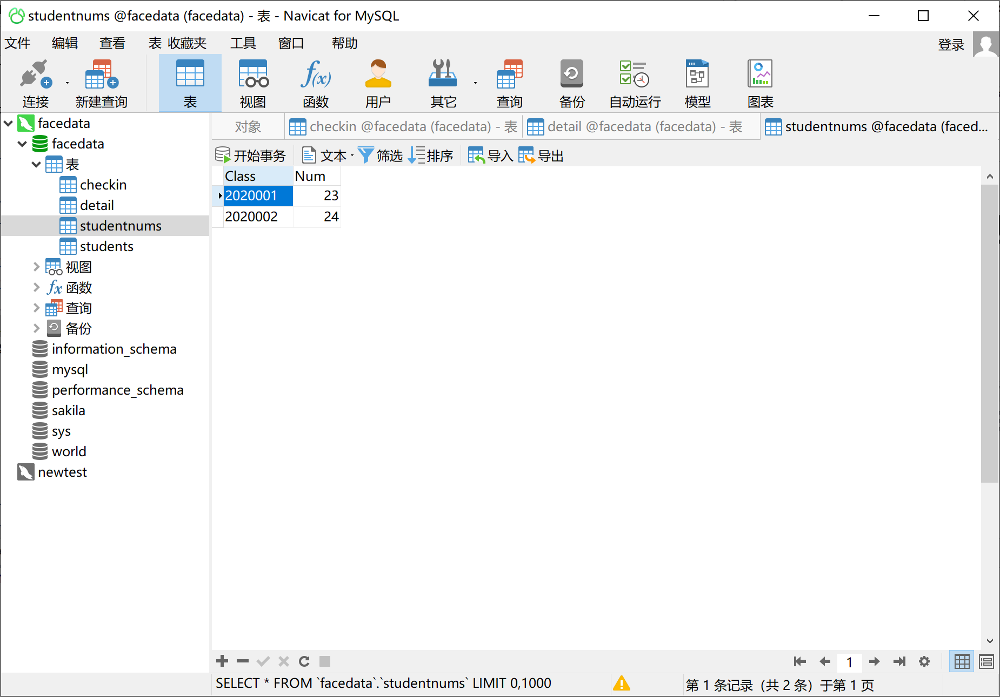

考勤表:
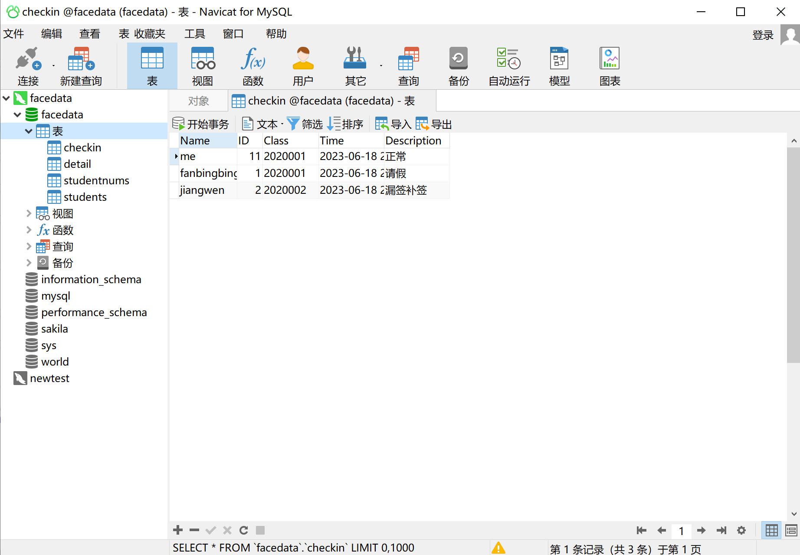

情绪分析详情表：
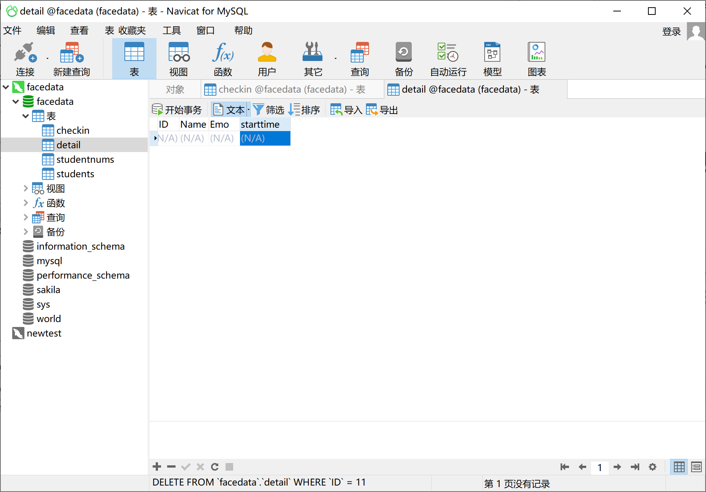


---

## 5.4 PyMySQL 使用

> Github：https://github.com/PyMySQL

项目中只使用了简单的写入、查询等几个常用命令，即使没有数据库基础上手也比较容易。例如：

```python
# 连接数据库
db = pymysql.connect(host="localhost", user="root", password="mysql105", database="facerecognition")

# 查询语句，实现通过ID关键字检索个人信息的功能
sql = "SELECT * FROM STUDENTS WHERE ID = {}".format(self.input_ID)
```

---

# 6. 源码介绍及使用🍨 

---
## 6.2 关键文件说明

- `model_face_detection/res10_300x300_ssd_iter_140000.caffemodel`：OpenCV提供的训练好的人脸检测ResNet-SSD模型权重。
- `model_facenet/openface_nn4.small2.v1.t7`：OpenFace提供的基于Inception的训练好的FaceNet模型权重。
- `emo/intel/emotions-recognition-retail-0003/FP32:`
- `mysql_table/facerecognition.sql`：mysql表格。

---

## 6.3 需要修改源码部分

1. 安装 **msqlservice** 然后修改 `execute.py`文件中的数据库连接代码。比如 `db = pymysql.connect("localhost", "root", "mysql105", "facerecognition")`。这首先需要在 navicat中创建数据库。
2. 如果不是通过本系统的信息采集功能采集的人脸照片，请将采集的人脸照片放到 `face_dataset/XX` 路径下，其中`XX`是学号（唯一索引），如果是通过系统采集的，则会自动存放在该路径下，不需要修改。
3. <font color=red>**注意：考虑到班级成员信息存储在数据库中，因此本地的信息采集界面不支持人脸的增删，只支持修改。所以当在本地采集了很多人脸并训练完模型之后，一定要确保采集的人脸ID已经存在于数据库之中，否则可能导致闪退！**</font>

---

## 6.4 使用步骤 

1. navicat创建数据库，打开数据库录入学生信息和班级信息；
2. 修改源码中的数据库连接部分，连接到创建的数据库；
3. 修改文件`GlobalVar.py` 中的路径；
4. 采集人脸照片，点击界面中的<kbd>信息采集</kbd>，在子窗口操作即可，注意保证本地文件夹的名称和数据库中的ID对应，每个ID的人脸在100--300张较好；
5. 回到主界面，点击界面中的<kbd>模型训练</kbd>，以训练人脸识别模型；
6. 开始考勤和行为分析：<kbd>打开相机</kbd> --> <kbd>开始分析</kbd>；
7. 查看每个学生表情情况：<kbd>分析详情</kbd>；

---
